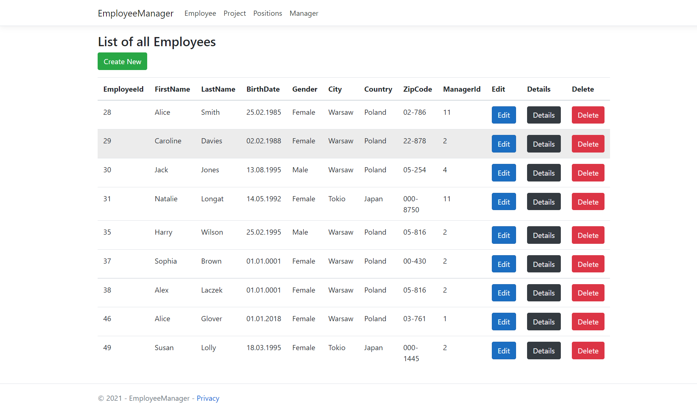
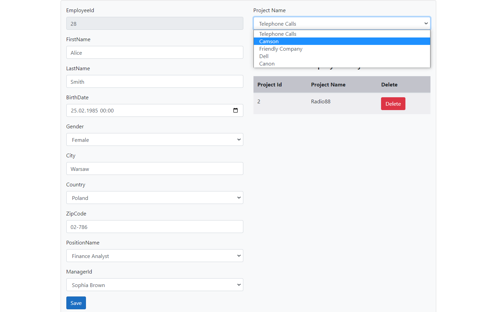
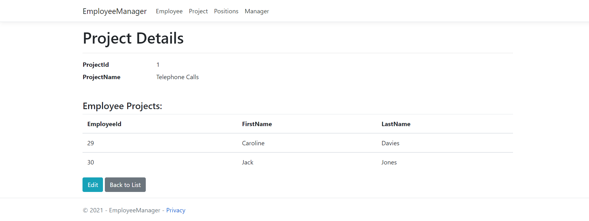
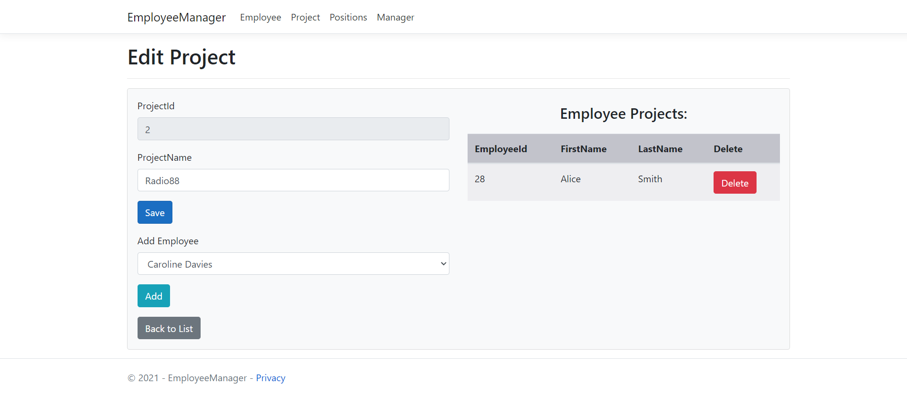
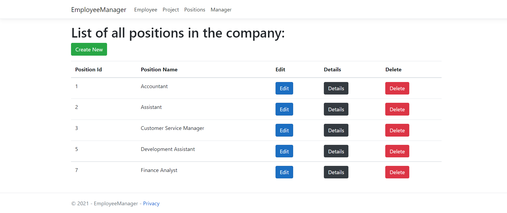
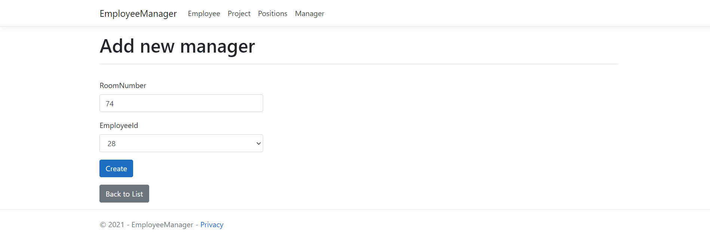

# EmployeeManager

EmployeeManager is a CRUD application which allows managers to manage employees and assign projects to them.

## Description

Application built using ASP.Net Core MVC. On the homepage there is a list with all company employees, whose personal data you can display or edit. It is possible to remove user from database.

We can edit employee's data such as his Position, Manager or assign employee to another project.

Other links in the navbar allow us to see all available positions and projects. In addition you can edit managers and assign new users to this role.

## Built With

- .NET 5.0

- Entity Framework Core 5.0

- Bootstrap
